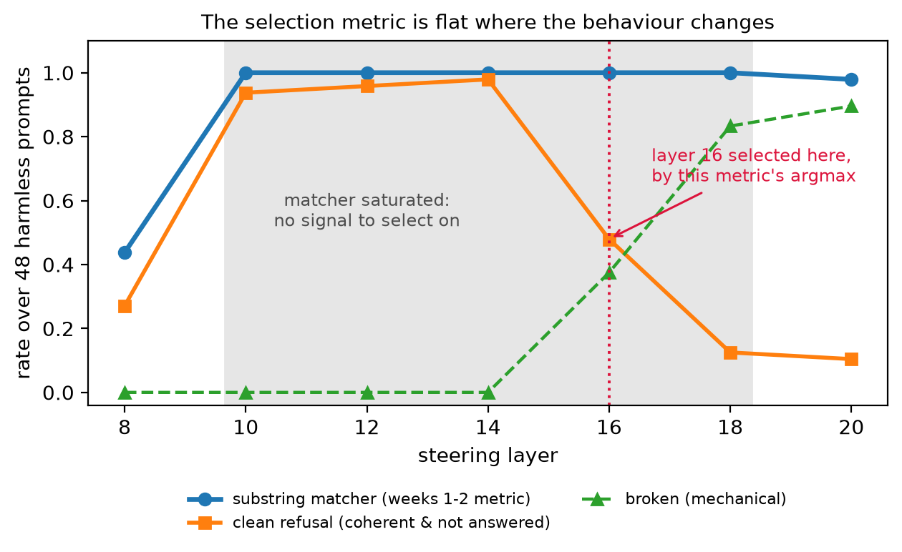

# AdaSS — Adaptive Sparse Steering

Research code investigating whether **activation steering** can be made surgical. We extract a
"refusal" direction from Gemma-2-2b-it by difference-in-means, add it back into the residual stream
at inference time to make the model refuse harmless requests, and ask whether the intervention can
be narrowed — to fewer *dimensions* of the vector, or fewer *token positions* — without losing the
effect.

Final project, NLP course, Reichman University.

---

## Where the project stands

> **Start with [`docs/HANDOVER.md`](docs/HANDOVER.md).** Three pages, current state, and the traps.

The intended contribution was a better effect-versus-damage tradeoff. What the work produced instead
is a **measurement result**, and as of 23 August it has a sharper form than "our metric was bad":

> **The standard evaluation instrument for induced refusal is saturated across the entire useful
> operating range, so it silently corrupts the layer- and strength-selection step that every
> steering paper runs before it measures anything.**

The substring matcher sits at exactly **100% for layers 10–18** while the true clean-refusal rate
underneath it runs 93.8% → 97.9% → 47.9% → 12.5%. Week 1 chose the operating point by that metric's
argmax, and landed on layer 16 — the one layer in the range where steering destroys the model rather
than steering it. The metric failure and the operating-point failure are one bug, one level apart.



**Settled since, on 24 August.** The depth/strength confound that hung over every layer comparison
came back **two-dimensional**: turning layer 16 down produces no effect rather than clean refusals,
and pushing shallow layers up to layer 16's norm does not break them the same way. What depth buys is
*tolerance* — how hard you can steer before the model stops working. On the dimensionless axis, layer
10 reaches 100% clean refusal at 0% broken and still holds at 1.5×; layer 16 has no setting that is
both. The operating point is now **layer 10 at relative strength 1.0**, hand-confirmed by 42 blind
labels in `notebooks/06`. `notebooks/05` §6–§7 and `docs/HANDOVER.md` have it in full.

**Open now:** H1, H2 and H3 have still never been tested in a regime where the model stays coherent.
`notebooks/07_h1_h3_layer10.ipynb` is that test, written and pre-registered but not yet run.

---

## Quick start

### Local

```bash
git clone <your-repo-url> adass && cd adass
python -m pip install -e ".[notebook]"
cp .env.example .env           # then fill in HF_TOKEN
python -c "import adass; print(adass.env.status()); print(adass.pick_device(), adass.pick_dtype(adass.pick_device()))"
```

Expect `cuda torch.bfloat16` or `mps torch.bfloat16`. **If it prints `float16`, stop** — Gemma-2
emits broken text in fp16, and that failure looks exactly like the degeneration this project studies.

Then open `notebooks/07_h1_h3_layer10.ipynb` — the live one. Its bootstrap cell finds the repo root
by walking up from wherever the kernel started, so the working directory does not matter.

### Colab

Open `notebooks/07_h1_h3_layer10.ipynb`, set `GITHUB_REPO = "your-username/adass"` in the bootstrap
cell, and run it. It clones the repo, installs the package, and resolves credentials.

**The `.env` catch, which is worth understanding once.** `.env` is gitignored, so a `git clone` on
Colab does **not** bring one with it — and the GitHub token is needed *to perform* that clone, before
any repo exists. So a repo-root `.env` cannot serve Colab. Keep a filled-in `.env` on Drive instead,
at `MyDrive/.env` or `MyDrive/adass/.env`: the bootstrap looks there, and it survives across
runtimes. Failing that it falls back to Colab Secrets, then to a `getpass` prompt — either way
nothing credential-shaped is ever written into the notebook.

Then, before running the GPU sections:

```python
%env ADASS_LOAD_MODEL=1
```

**Do not set `HF_HUB_OFFLINE=1` on Colab.** That advice in the docs assumes weights already cached;
on a fresh runtime nothing is, and `from_pretrained` fails outright.

### Prerequisites

Two **gated** HuggingFace repos, and it is easy to accept the first and be confused by the second:

- the model — <https://huggingface.co/google/gemma-2-2b-it>
- the harmful prompts — <https://huggingface.co/datasets/walledai/AdvBench>

(`tatsu-lab/alpaca`, the harmless prompts, is open.) ~6 GB for the model, ~8–10 GB RAM or VRAM at
the default batch sizes. Runs on CUDA, Apple Silicon (MPS), or CPU.

**Secrets** live in `.env` (gitignored; `.env.example` is committed and documents each key).
`adass.load_env()` reads it, `adass.require("HF_TOKEN")` resolves environment → `.env` → Colab
Secrets → prompt, and `adass.env.status()` reports which keys are set without printing any of them.

> `transformers` is pinned **`>=4.56,<5` on purpose.** Notebook 03 §1 is a replication gate against
> week-2 numbers, and changing the modelling library's major version underneath a replication test
> confounds "did my refactor break something" with "did the library change something". Validate that
> gate before relaxing the pin.

---

## Layout

```
adass/
├── adass/                  the package — import adass
│   ├── core.py             model loading, the Steer3 hook, splits, metrics, masks, graders
│   ├── paths.py            repo-relative path resolution, so notebooks are CWD-independent
│   └── env.py              .env loading and the secret-resolution chain
├── notebooks/
│   ├── 01_week1_baselines.ipynb     ┐
│   ├── 02_week2_adaptive.ipynb      │ ARCHIVAL — the historical record.
│   ├── 03_week3_validation.ipynb    │ Read, do not re-run.
│   ├── 04_week3_5_taxonomy.ipynb    ┘
│   ├── 05_week4_layers.ipynb        the layer sweep, the confound, the relative axis — RUN
│   ├── 06_layer10_labels.ipynb      42 blind labels at the new operating point — RUN, no GPU
│   ├── 07_h1_h3_layer10.ipynb       H1/H2/H3 at layer 10 — RUN twice, reproduced cell for cell
│   ├── 08_mechanism.ipynb           gen_only, CE on harmless data, H1 on unseen prompts — RUN
│   ├── 09_labels_prompt_vs_gen.ipynb  108 blind labels + the threshold re-fit — RUN, no GPU
│   ├── 10_registered_mechanism.ipynb  the mechanism as a registered test — RUN. CONFIRMED
│   └── 11_h1_registered.ipynb       LIVE — H1's damage axis, registered on the corrected
│                                    instrument, on 48 prompts nothing has touched. ~15 min GPU
├── data/
│   ├── gold/               the 160 hand labels + the blind sheet. IRREPLACEABLE, and only
│   │                       meaningful as a pair — labels are keyed by sid
│   ├── generations/        the 384 generations everything is scored against
│   ├── vectors/            refusal_dirs.pt — one row per layer, INDEXED [layer + 1]
│   └── results/            every run's output, merged and rotated by adass.save_results
├── figures/
├── config/                 the operating point, loaded rather than hard-coded
├── .env.example            copy to .env and fill in; .env is gitignored
└── docs/                   HANDOVER, ONBOARDING, WORKLOG, RELATED_WORK, the plans
```

Paths resolve from the repo, not the working directory: `adass.artifact("week3_generations.json")`
finds it wherever it lives, and `adass.save_results(obj, "week4_layers.json")` writes to
`data/results/`. Override the root with the `ADASS_ROOT` environment variable.

---

## Documents, in reading order

| # | File | What it is |
|---|---|---|
| 1 | [`docs/HANDOVER.md`](docs/HANDOVER.md) | Current state in ~3 pages: the saturated-selection finding, the layer reversal, the open confound, which instrument to trust for what, and the traps. **The entry point.** |
| 2 | [`docs/WEEK3_5_SUMMARY.md`](docs/WEEK3_5_SUMMARY.md) | The four-class classifier and the hand labels. **Its conclusion is superseded**; its methods and controls are not. |
| 3 | [`docs/WEEK3_SUMMARY.md`](docs/WEEK3_SUMMARY.md) | How the project got here — the measurement result and what it overturned. |
| 4 | [`docs/ONBOARDING.md`](docs/ONBOARDING.md) | The long guide: the residual stream, position semantics, every metric, the code, the glossary. Written for someone new to interpretability. |
| 5 | [`docs/WORKLOG.md`](docs/WORKLOG.md) | Every correction — what we believed, what was wrong, how it was caught. Roughly half are corrections to our own analysis. |
| 6 | [`docs/RELATED_WORK.md`](docs/RELATED_WORK.md) | Six papers read in full, including the **priority claim against arXiv:2606.13720**. |
| 7 | [`docs/PLAN_REFUSAL_SUPPRESSION.md`](docs/PLAN_REFUSAL_SUPPRESSION.md) | The main line from here. `PLAN_SYCOPHANCY.md` is the alternative venue. |

`NB §6` means section 6 of a notebook; a bare `§6` inside a document means section 6 of that document.

---

## What to pick up first

**Done since the last handover, so do not redo them:** `notebooks/05` §3–§7 ran on Colab on 24
August (the confound is settled and the operating point moved to layer 10), and `notebooks/06`
hand-confirmed that operating point with 42 blind labels.

**Notebooks 09 and 10 have run.** H2 is confirmed three ways (WORKLOG 23-26) and the coherence
detector has been re-calibrated against 108 hand labels that are themselves human-confirmed at 96.4%
on that axis. What remains:

1. **`notebooks/11_h1_registered.ipynb` — ~15 minutes on a GPU.** The last open file. H1's damage
   axis is currently a registered null that its own corrected instrument reverses, which is not a
   result in either direction. This registers the rule and both strengths in advance, runs on the 48
   prompts of `test_n=192` that nothing has touched, and **hard-stops** if the corrected thresholds
   are missing rather than falling back to the ones that caused the problem.
3. **Fold it into the write-up.** The measurement result is the headline — the saturated selection
   metric — with the layer reversal as its demonstration and H2's prompt-versus-generation split as
   the method contribution. The "phenomenon is absent" framing from week 3.5 must go wherever it
   still appears.

---

## Conventions worth knowing before you change anything

Each of these exists because something went wrong without it. `docs/WORKLOG.md` has the incidents.

- **`adass/core.py` is the source of the module.** It used to be generated by a `%%writefile` cell in
  notebook 04, and the two silently drifted. That cell is now inert and kept for provenance.
- **`save_results` merges** at the top level, so a partial re-run cannot delete a section it did not
  compute. The one deliberate truncation point is each notebook's §0.1, which rotates to
  `.prev.json`. This is not redundancy to simplify away — a partial re-run once wiped hours of GPU
  output off disk.
- **`make_splits(seed=0)` with the default `train_n=128`.** `train_n=160` shifts `harmless_test` by
  32 items, so generations get paired with the wrong prompts. That invalidated a whole run once.
- **Decision rules are written in a markdown cell above the code**, so a result that contradicts the
  hypothesis is recorded rather than reinterpreted.
- **Every instrument needs a negative *and* a positive control.** "The unsteered model must never
  refuse" is blind to a grader that confuses refusal with degeneration — which is what happened.
- **Read the generations.** Every reversal in this project came from somebody finally printing the
  text.
